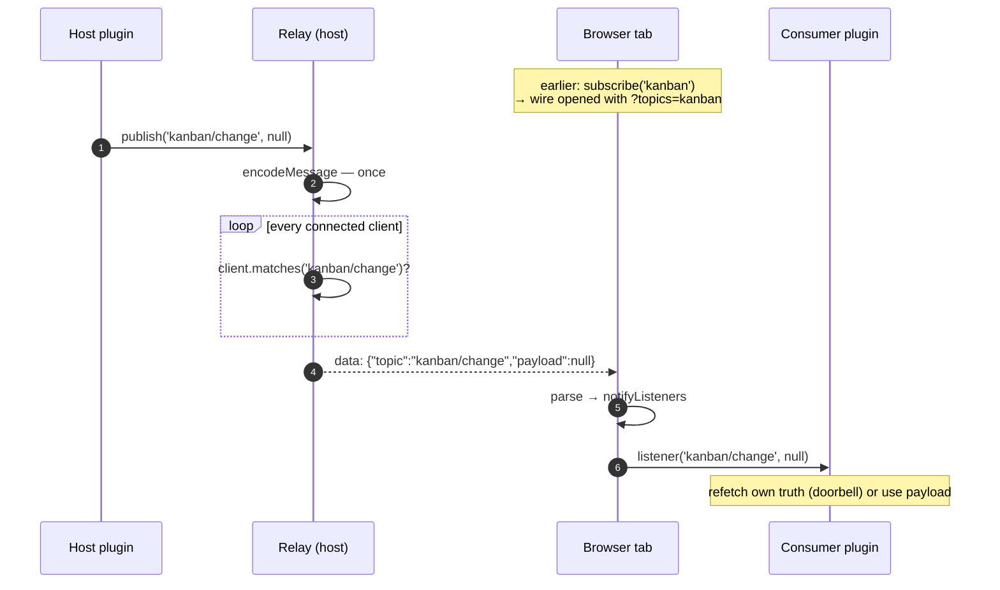
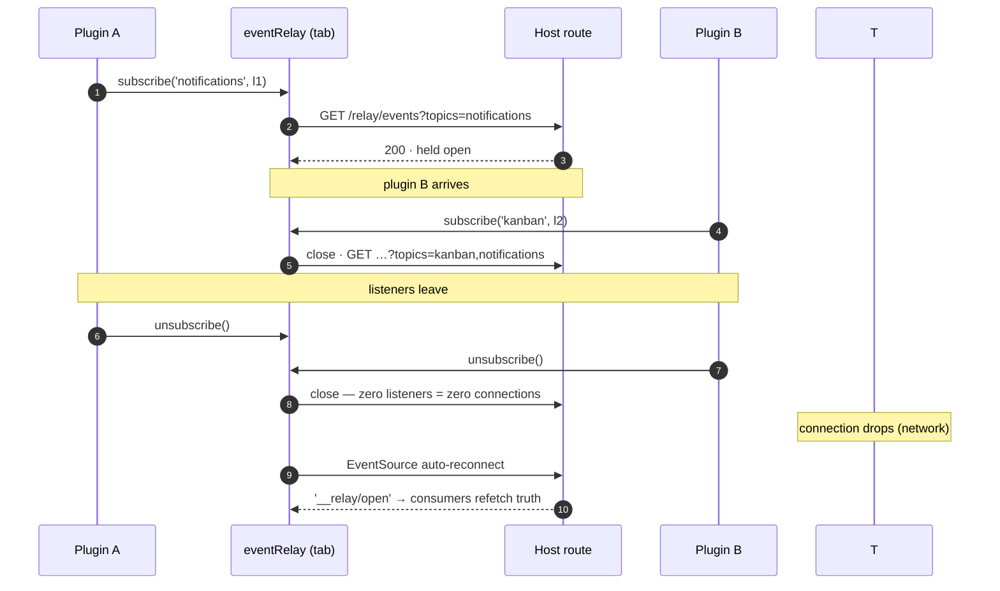

# dsh-event-relay

**Push from host to browser.** The host can start a conversation; every other
channel (fetch, RPC) requires the browser to ask first. If your plugin's UI
should react the moment something happens host-side — a setting changed, a
build finished, a notification arrived — this is that channel.

One shared SSE route (`/relay/events`) holds every subscriber's response open
and streams JSON messages `{"topic","payload"}` as things happen. One
connection per browser tab, no matter how many plugins subscribe.

## Why not…

| alternative | falls short |
|---|---|
| polling | latency + waste (N fetches to learn "nothing changed") |
| refetch on focus/navigation | free and correct, but updates only when the user acts |
| your own EventSource/WebSocket per plugin | the browser caps ~6 connections/domain (HTTP/1.1); a few plugins permanently occupy them and **every other request queues** — this shared stream is one connection for the whole tab |
| host RPC (`/api`) | request→response: the frontend can ask, but the host cannot interrupt |

**One direction, on purpose.** Browser→host is transaction-shaped (command →
reply): use plain HTTP — a route your host half registers — with status codes,
validation, and error handling the stream doesn't have. Host→browser is
notification-shaped: unpredictable moments, all tabs at once. Different jobs,
different roads.

## How a message travels



## Producers (host plugins)

```js
const relay = ctx.get('eventRelay')            // optional — degrade if absent
relay.publish('my-topic', payload)             // direct
ctx.on('my/event', (data) => relay.publish('my/event', data))   // mirror a Cordis event (do this in your plugin)
```

## Consumers (browser bundles)

```js
const relay = ctx.get('eventRelay')            // provided by this package's client half
const unsubscribe = relay.subscribe('kanban', (topic, payload) => { ... })
// or raw: new EventSource('/relay/events?topics=kanban,notifications')
```

`payload` in the callback is whatever the publisher passed. Apply it directly
or ignore it and refetch your own truth — both are first-class styles.

Topic filtering: a subscription matches its exact topic and any child topic
(`'kanban'` matches `'kanban/change'`). The browser's connection URL carries
the union of the tab's topics, so the server only sends what this tab listens
for. When the last listener of the tab unsubscribes, the connection closes.

## Connection lifecycle



On every (re)open — first connect, filter widening, auto-reconnect after a
drop — subscribers of the synthetic topic `__relay` receive `'__relay/open'`.
Consumers that apply state from messages use it to resynchronize: anything
missed while the stream was down is recovered by one refetch.

## Design

Transport, not a bus: Cordis events remain the host-side event system; this
only carries messages across the plane boundary.

Payload is optional, not doorbell-only. Some plugins use the relay purely as a
change signal — a topic-only message that tells them to refetch their own
truth. Others consume the payload directly: the notifications demo pushes the
notification itself, a kanban board pushes change messages. `publish(topic,
payload)` — send whatever is useful; doorbells are one usage style, not the
contract.

Liveness, not correctness: the relay may be absent, and a consumer should
fall back to pull-on-focus (or pull on `__relay/open`) rather than depend on
the stream for state.
Route roots are composition-level contracts (`/api`, `/plugins`,
`/workspace-history`, `/notifications`, `/granular-settings` are taken).

## Debugging

The wire can be listened to from a terminal — very useful to verify publishes
end-to-end without a browser:

```
curl -N 'http://127.0.0.1:3080/relay/events'
```

Add `?topics=<prefixes>` to mirror a client's filter; `-N` makes curl stream
instead of buffering.
